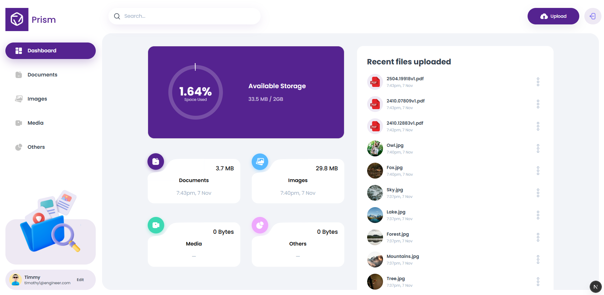
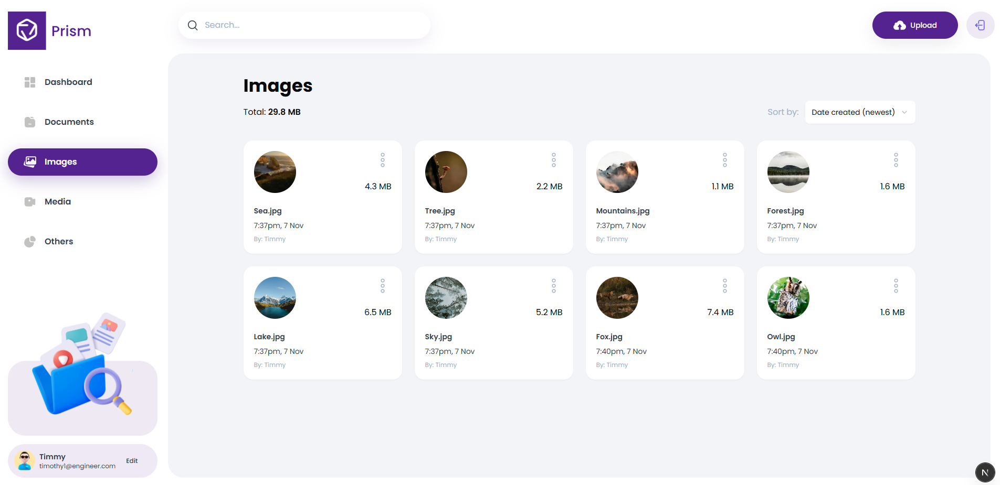

# Prism - Cloud Storage Platform

A modern, full-featured cloud storage platform built with Next.js 16 and Appwrite, featuring secure file management, real-time collaboration, and an elegant user interface.



## 🌟 Overview

Prism is a comprehensive cloud storage solution that enables users to upload, organize, share, and manage files seamlessly. With a focus on user experience and performance, it provides an intuitive interface for handling various file types while maintaining robust security and efficient storage management.

## ✨ Key Features

- **Secure Authentication** - Email-based OTP authentication system powered by Appwrite
- **File Management** - Upload, view, rename, download, and delete files with ease
- **File Sharing** - Share files with other users via email for seamless collaboration
- **Smart Dashboard** - Visual insights into storage usage, recent uploads, and file type distribution
- **Global Search** - Quickly find files across your entire storage
- **Advanced Sorting** - Organize files by date, name, or size
- **Profile Management** - Update your profile name and avatar
- **Responsive Design** - Optimized experience across desktop, tablet, and mobile devices
- **File Type Support** - Handle documents, images, videos, audio files, and more



## 🛠️ Tech Stack

- **Framework:** Next.js 16.0.1
- **Frontend:** React 19.2.0
- **Backend:** Appwrite 20.3.0 (Authentication, Database, Storage)
- **Styling:** Tailwind CSS 3.4.18
- **UI Components:** shadcn/ui (Radix UI)
- **Language:** TypeScript 5
- **Form Handling:** React Hook Form 7.66.0 + Zod 4.1.12
- **Charts:** Recharts 2.15.4
- **File Upload:** React Dropzone 14.3.8

## 🚀 Getting Started

### Prerequisites

- Node.js 18+ and npm
- An Appwrite account ([sign up here](https://cloud.appwrite.io/))

### Installation

1. **Clone the repository**
```bash
git clone https://github.com/AdnanElAssadi56/Prism.git
cd Prism
```

2. **Install dependencies**
```bash
npm install
```

3. **Set up environment variables**

Create a `.env.local` file in the root directory:

```env
NEXT_PUBLIC_APPWRITE_ENDPOINT="https://cloud.appwrite.io/v1"
NEXT_PUBLIC_APPWRITE_PROJECT="your-project-id"
NEXT_PUBLIC_APPWRITE_DATABASE="your-database-id"
NEXT_PUBLIC_APPWRITE_USERS_TABLE="your-users-table-id"
NEXT_PUBLIC_APPWRITE_FILES_TABLE="your-files-table-id"
NEXT_PUBLIC_APPWRITE_BUCKET="your-bucket-id"
NEXT_APPWRITE_KEY="your-api-key"
```

4. **Configure Appwrite**

- Create a new project in Appwrite
- Set up a database with two tables: `users` and `files`
- Create a storage bucket for file uploads
- Generate an API key with appropriate permissions
- Update the `.env.local` file with your credentials

5. **Run the development server**
```bash
npm run dev
```

Open [http://localhost:3000](http://localhost:3000) to view the application.

## 📁 Project Structure

```
prism/
├── app/                    # Next.js app directory
│   ├── (auth)/            # Authentication pages
│   ├── (root)/            # Main application pages
│   └── layout.tsx         # Root layout
├── components/            # React components
│   ├── ui/               # shadcn/ui components
│   └── ...               # Feature components
├── lib/                   # Utility functions and configurations
│   ├── actions/          # Server actions
│   ├── appwrite/         # Appwrite configuration
│   └── utils.ts          # Helper functions
├── constants/            # Application constants
├── types/               # TypeScript type definitions
└── public/              # Static assets
```

## 🎨 Color Theme

Prism uses a modern purple color scheme:

- **Primary:** `#552390` (Deep Purple)
- **Accent:** `#7B3FBF` (Light Purple)

## 📝 Environment Variables

| Variable | Description |
|----------|-------------|
| `NEXT_PUBLIC_APPWRITE_ENDPOINT` | Appwrite API endpoint |
| `NEXT_PUBLIC_APPWRITE_PROJECT` | Your Appwrite project ID |
| `NEXT_PUBLIC_APPWRITE_DATABASE` | Database ID |
| `NEXT_PUBLIC_APPWRITE_USERS_TABLE` | Users table ID |
| `NEXT_PUBLIC_APPWRITE_FILES_TABLE` | Files table ID |
| `NEXT_PUBLIC_APPWRITE_BUCKET` | Storage bucket ID |
| `NEXT_APPWRITE_KEY` | Appwrite API secret key |

## 🚢 Deployment

### Deploy to Vercel

1. Push your code to GitHub
2. Import your repository in [Vercel](https://vercel.com)
3. Add environment variables in the Vercel dashboard
4. Deploy!

[](https://vercel.com/new)

## 🤝 Contributing

Contributions are welcome! Feel free to open issues or submit pull requests.

## 📄 License

This project is open source and available under the MIT License.

## 🙏 Acknowledgments

- Built with [Next.js](https://nextjs.org/)
- Backend powered by [Appwrite](https://appwrite.io/)
- UI components from [shadcn/ui](https://ui.shadcn.com/)
